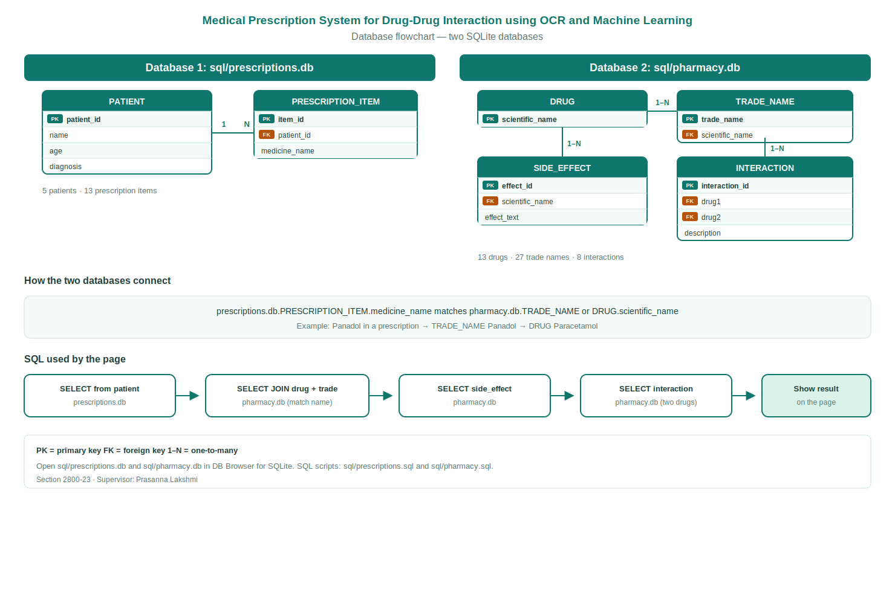
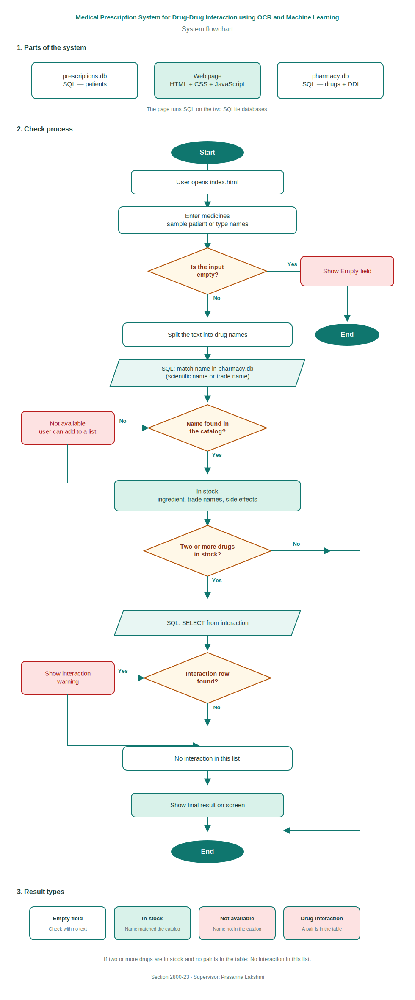

# Project Document

**Project title:** Medical Prescription System for Drug-Drug Interaction using OCR and Machine Learning

**Section:** 2800-23

**Supervisor:** Prasanalakshmi Balaji

**Date:** September 2026

## Team members

- Norah Saeed Alqahtani (445804256)
- Noura Hamad Hasan (445804642)
- Rawan Ali Almeshary (445804606)
- Wejdan Bandar (444820762)
- Zinah Ibrahem Saeed (445804594)

---

## 1. Introduction

In this project we built a simple website for checking medicines from a prescription. The user can type the medicine names, choose a sample patient, or upload a printed prescription picture. The program searches in a pharmacy SQLite database. If the medicine is found, it shows the scientific name, trade names, and side effects. If there are two or more medicines, it also checks for drug-drug interactions. If the medicine is not in the database, it shows that it is not available.

We also added a small machine learning part. It gives a risk score for medicine pairs based on drug features. This is only an extra help. The main check is still the SQL rules.

The website language is English. Medicine names are written the same way pharmacies write them, for example Panadol or Adol.

The data we used is a small sample for the course. This project is not medical advice and should not be used in a real pharmacy.

---

## 2. Objective

The main goal is:

1. Read medicines from text or from a printed image (OCR).
2. Match each medicine with the pharmacy database using SQL.
3. Show the result (found or not found).
4. Show side effects and known interactions when possible.
5. Show an ML risk score for pairs of found medicines.

Flowchart files used in the report (not website pages):

- `images/system-flowchart.png` (how the check works)
- `images/database-flowchart.png` (the two databases)

---

## 3. System components

| Part | What it does |
| --- | --- |
| `index.html` | Main page (patients, input, OCR upload, results) |
| `css/style.css` | Page style |
| `js/app.js` | Buttons and showing results |
| `js/match.js` | Splits the text and starts the check |
| `js/database.js` | Opens the databases and runs SQL |
| `js/ocr.js` | Reads the prescription image |
| `js/ml.js` | Trains and runs the ML risk model |
| `js/ml-features.js` | Drug features used by ML |
| `sql/prescriptions.db` | Patients and prescription items |
| `sql/pharmacy.db` | Drugs, trade names, side effects, interactions |
| `sources/` | CSV files used to build the databases |

---

## 4. Datasets

The CSV files are in the `sources/` folder. We build SQLite from them with:

```
python3 sql/build_from_sources.py
```

The full Kaggle files are very large, so we kept a smaller sample with the same columns.

### Prescriptions

File: `sources/medical_prescription_dataset.csv`

Source: [Medical Prescription Dataset](https://www.kaggle.com/datasets/mmumairkhattak/medical-prescription-dataset)

This file has sample patients (P1 to P10) and the medicines in each prescription.

### Drug-drug interactions

File: `sources/drug_drug_interactions.csv`

Source: [Drug-Drug Interactions](https://www.kaggle.com/datasets/mghobashy/drug-drug-interactions)

Columns: Drug 1, Drug 2, Interaction Description.

### Pharmacy catalog and side effects

Files:

- `sources/pharmacy_catalog.csv`
- `sources/drug_side_effects.csv`

These files have scientific names, trade names, and side effects for the medicines in our stock list.

---

## 5. Databases

We use two SQLite databases.

Insert this image in the report:



File: `images/database-flowchart.png`

| Database | Tables |
| --- | --- |
| `sql/prescriptions.db` | PATIENT, PRESCRIPTION_ITEM |
| `sql/pharmacy.db` | DRUG, TRADE_NAME, SIDE_EFFECT, INTERACTION |

One patient can have many prescription items. One drug can have many trade names and many side effects. A drug can also appear in many interaction rows.

When the user types a medicine name, the page runs SQL with SELECT and JOIN on `scientific_name` or `trade_name`.

You can open the `.db` files in DB Browser for SQLite. The same structure is also saved in `sql/prescriptions.sql` and `sql/pharmacy.sql`.

---

## 6. Flow

Insert this image in the report:



File: `images/system-flowchart.png`

1. The user opens the page with a local server.
2. The user types medicines, picks a sample patient, or uploads a printed image.
3. If an image is uploaded, OCR reads the text and tries to find medicine names.
4. The program splits the text by comma or new line.
5. Each name is checked in `pharmacy.db`.
6. If found, the page shows the drug info and side effects.
7. If two or more drugs are found, the page checks the interaction table.
8. The ML model also gives a risk score for each pair.
9. If not found, the page shows not available.

---

## 7. OCR and Machine Learning

### OCR

We used Tesseract.js to read English text from a printed prescription image. After OCR, the program looks for medicine names that exist in our pharmacy list. A sample image is in `samples/sample-prescription.png`.

### Machine Learning

We used TensorFlow.js in the browser. The model trains when the page opens. It uses simple drug features (for example drug class and some metabolism flags) and learns from the interaction table. Then it gives a probability score for each pair. This part is small and only for the course demo. It is not a real clinical tool.

---

## 8. Limitations

- The data sample is small.
- Name matching is basic (similar spelling / lower case).
- OCR may fail if the image is not clear.
- The ML model is trained on a small set, so the score is only a rough estimate.
- This is a student project, not a hospital system.

---

## 9. How to run

Because OCR and ML need special browser features, do not open the file directly. Use a local server:

```
python3 -m http.server 8000
```

Then open http://localhost:8000/ in Chrome.

To see the tables, open `sql/prescriptions.db` and `sql/pharmacy.db` in DB Browser for SQLite.
